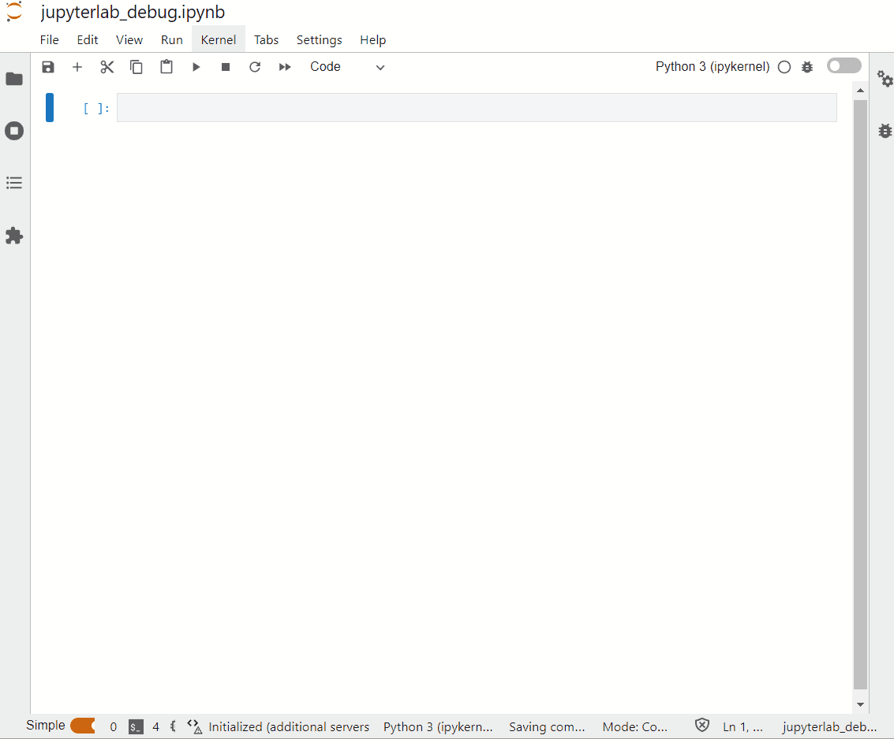

# jupyterlab_and_friends
## Visual debugger
JupyterLab from version 3 ships with visual debugger, what it is needed to enable and use it is to have kernel with support for debugging for example `ipykernel` version 6. Install it and debugger will be available to use:

`conda install -c conda-forge ipykernel>=6`

